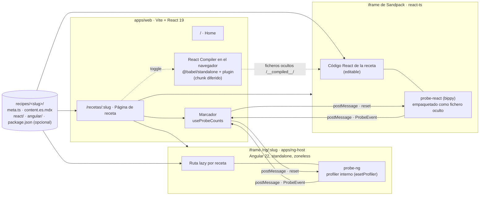

# Render Lab

Angular y React resolviendo la misma receta, lado a lado, con los dos frameworks
ejecutándose de verdad y unas sondas que enseñan qué componentes vuelven a
ejecutar su vista en cada interacción.

- **Qué es.** Un laboratorio: cada receta ejecuta el mismo árbol de componentes
  en Angular y en React, cada componente que vuelve a ejecutar su vista parpadea
  y lleva un badge con su contador, y un marcador común suma los dos lados para
  la misma interacción.
- **Qué no es.** No es un benchmark ni una competición. Los contadores miden
  cuántas veces se vuelve a ejecutar el código de vista (la función del
  componente en React, el template en Angular), no cuánto tarda ni cuánto DOM
  cambia. Los dos lados corren en modo desarrollo, y la web lo dice en pantalla.

La web está en español (`docs/CONSTITUTION.md`, P8).

## Cómo funciona



1. **Una receta es una carpeta** en `recipes/<slug>/`: `meta.ts` (slug, orden,
   título y resumen por idioma), `content.es.mdx` (la explicación), `react/`
   (lo que corre en Sandpack) y `angular/` (lo que corre en ng-host).
2. **ng-host** es una única app Angular que genera una ruta lazy `/ng/<slug>` por
   cada `recipes/<slug>/angular/index.ts`. En desarrollo la sirve `ng serve` en
   el puerto 4300 y Vite la proxea bajo `/ng/`; en producción se construye en
   configuración de desarrollo y se copia a `apps/web/public/ng`.
3. **Sandpack** ejecuta el código React de la receta en su propio iframe. El lab
   le pasa los ficheros de `react/` tal cual, más dos ficheros ocultos: la sonda
   y un `entry` que la conecta al lab, monta `App` y aplica StrictMode si toca.
4. **Las sondas** (`packages/probe-ng`, `packages/probe-react`) se enganchan al
   profiler interno de cada framework, dibujan el parpadeo y el badge en una
   capa propia y envían al lab, por `postMessage`, un `ProbeEvent` por instancia
   con su contador. El lab valida cada mensaje con Zod (`packages/protocol`) y
   suma. El botón Reset envía la orden `reset` a los dos iframes.
5. **React Compiler**: al activar el toggle, el lab descarga en diferido
   `@babel/standalone` y `babel-plugin-react-compiler`, compila el código de la
   receta en el navegador y le pasa a Sandpack el resultado en ficheros ocultos
   bajo `/__compiled__/`. El lector sigue editando el original; cada edición se
   recompila. Junto al toggle se ve cuántos componentes se compilaron y un aviso
   si son 0 o si la compilación falla.

## Stack

| Pieza                  | Qué                                                                                                                                      |
| ---------------------- | ---------------------------------------------------------------------------------------------------------------------------------------- |
| Monorepo               | pnpm workspaces (`apps/*`, `packages/*`, `recipes/*`)                                                                                    |
| `apps/web`             | Vite 8, React 19.2, React Router 8, MDX (`@mdx-js/rollup` + `remark-gfm`), Sandpack 2.20                                                 |
| `apps/ng-host`         | Angular 22.2 (standalone, zoneless, signals), `@angular/build`                                                                           |
| `packages/protocol`    | Schemas Zod: meta de receta, `package.json` de receta, eventos de sonda y órdenes del lab                                                |
| `packages/probe-ng`    | Sonda Angular sobre `ɵsetProfiler`                                                                                                       |
| `packages/probe-react` | Sonda React sobre `bippy`, empaquetada en un único ESM para Sandpack                                                                     |
| React Compiler         | `@babel/standalone` + `babel-plugin-react-compiler`, en el navegador y en diferido                                                       |
| Estilos                | CSS Modules con variables CSS (claro/oscuro por `prefers-color-scheme`), sin librerías de componentes; IBM Plex Sans y Mono autoalojadas |
| Calidad                | TypeScript strict, ESLint (con `eslint-plugin-react-hooks`), Prettier, Vitest, Playwright                                                |

Las versiones de `react`, `react-dom`, `bippy`, `@babel/standalone`,
`babel-plugin-react-compiler` y `@angular/*` van fijadas sin `^` ni `~`: las
sondas y el compiler dependen de internos (`docs/CONSTITUTION.md`, §6).

## Arrancarlo

Requisitos: Node 24 y pnpm 12 (`packageManager` en `package.json`).

```sh
pnpm install
pnpm dev          # sonda React en watch + ng-host (4300) + web (5173)
```

Abre <http://localhost:5173>. `Ctrl+C` para todo el árbol de procesos.

| Script                      | Qué hace                                                                 |
| --------------------------- | ------------------------------------------------------------------------ |
| `pnpm lint`                 | ESLint en todo el monorepo                                               |
| `pnpm typecheck`            | `tsc` en cada paquete (ng-host regenera antes sus rutas)                 |
| `pnpm test`                 | Vitest: `packages/protocol`, `packages/probe-ng`, `packages/probe-react` |
| `pnpm build`                | Sonda React → ng-host (a `apps/web/public/ng`) → web (a `apps/web/dist`) |
| `pnpm --filter web preview` | Sirve el build de producción (web y `/ng/` desde `dist`)                 |
| `pnpm --filter web e2e`     | Playwright contra `pnpm dev` (lo arranca si no está en marcha)           |
| `pnpm format`               | Prettier                                                                 |

El despliegue es estático: la salida de `pnpm build` (`apps/web/dist`) incluye el
build de ng-host bajo `/ng/`. Las rutas de la web (`/recetas/:slug`) y las de
ng-host (`/ng/<slug>`) necesitan que el servidor sirva su `index.html` en las
URLs sin extensión (en `vite preview` lo hace un plugin de `vite.config.ts`).

## Añadir una receta

Crear `recipes/<slug>/` (slug en kebab-case) con:

```
recipes/<slug>/
├── meta.ts             # defineRecipe({ slug, order, title: { es }, summary: { es } })
├── content.es.mdx      # explicación; admite tablas (GFM)
├── react/App.tsx       # export default function App(); más ficheros si hacen falta
├── angular/index.ts    # export default: componente raíz standalone
└── package.json        # opcional: dependencias npm del código React, versión exacta
```

- El `slug` de `meta.ts` debe coincidir con el nombre de la carpeta; `draft: true`
  la oculta del listado.
- El código de `react/` y `angular/` no importa las sondas ni contiene
  contadores: la instrumentación vive fuera (P3).
- Si `react/` importa paquetes npm además de `react` y `react-dom`, el
  `package.json` los declara con versión exacta y `name` igual a
  `@render-lab/recipe-<slug>`; `pnpm install` regenera `pnpm-lock.yaml`. Ni
  `react` ni `react-dom` pueden declararse: los fija el lab.
- Una receta nueva exige reiniciar `pnpm dev` (ng-host genera sus rutas al
  arrancar). Editar una receta existente no lo exige.

Los directorios de `recipes/` que empiezan por `_` son fixtures (p. ej. `_smoke`)
y no aparecen en la web.

## Forma de trabajo

El proyecto sigue **SDD** (spec-driven development): `docs/CONSTITUTION.md`
fija las reglas (principios técnicos, métrica, zonas, versiones) y
`docs/IDEA.md` es la fuente de verdad del diseño; ante conflicto prevalece la
constitución. El trabajo va por tareas (T01…T07), una por sesión, con el diff
revisado por el humano, que es quien hace el commit.

El reparto es híbrido porque el proyecto tiene dos objetivos con el mismo peso:
el producto y el aprendizaje de React por parte del humano.

| Zona       | Rutas                                                                                                                                                                             | Quién escribe                               |
| ---------- | --------------------------------------------------------------------------------------------------------------------------------------------------------------------------------- | ------------------------------------------- |
| Agente     | raíz (salvo `README.md`), `.github/`, `scripts/`, `apps/web/**` salvo `src/`, `apps/ng-host/`, `packages/protocol`, `packages/probe-ng`                                           | El agente                                   |
| Humano     | `apps/web/src/**`, `recipes/*/react/**`, `recipes/*/content.*.mdx`, `recipes/*/meta.ts`, `recipes/*/package.json`, `packages/probe-react`, `docs/CONSTITUTION.md`, `docs/IDEA.md` | El humano (el agente solo revisa y propone) |
| Compartida | `recipes/*/angular/**`, el resto de `docs/`, `README.md`                                                                                                                          | El agente redacta, el humano valida         |

Todo fichero con código React lo escribe el humano, esté donde esté, salvo
autorización explícita para un fichero concreto en esa misma sesión. Los spikes
(`spikes/`) son desechables: no están en el workspace, no corren en CI y no se
importan desde el monorepo.

## Decisiones de arquitectura

> **Borrador.** Esta sección la redacta el agente como propuesta; según la
> constitución (§4.3) las decisiones de arquitectura las escribe el humano.
> Pendiente de revisión.

### La métrica es simétrica y los dos lados corren en modo desarrollo

Lo que se compara es «cuántas veces vuelve a ejecutarse el código de vista» y
se define igual en los dos lados: en React, 1 por cada commit en el que el
componente se renderizó (la doble invocación de StrictMode no cuenta doble); en
Angular, 1 por cada update pass en el que su template se re-evaluó (el pase
`checkNoChanges` de dev mode no cuenta). No se cuentan mutaciones de DOM ni
tiempos: mezclar métricas convertiría el marcador en una carrera que no mide
nada. Las dos sondas dependen de hooks que solo existen en modo desarrollo
(`ɵsetProfiler` en Angular, el hook de DevTools que usa bippy en React), así que
los dos lados se ejecutan así y la web lo indica en pantalla.
Ver `spikes/ng-probe/SPIKE.md` y `spikes/react-probe/SPIKE.md`.

### Un único ng-host

Todas las recetas Angular viven en una sola app (`apps/ng-host`) como rutas
lazy, en vez de una app por receta. Así hay un solo `angular.json`, una sola
copia de `@angular/*` y un solo build que se copia a `apps/web/public/ng`.
Añadir una receta sigue siendo crear una carpeta: un script genera las rutas a
partir de `recipes/*/angular/index.ts`. La sonda registra la raíz de cada
receta y solo mide esa raíz y sus descendientes, nunca los componentes del host.

### Las sondas no tocan el código medido

El código que ve el lector (`recipes/*/react/**`, `recipes/*/angular/**`) no
importa sondas ni lleva contadores ni `postMessage`: si lo llevara, la receta
dejaría de ser el código idiomático que se quiere comparar y cualquier lector
podría sospechar de la medición. Las sondas se enganchan por fuera: la de
Angular al profiler interno (`ɵsetProfiler`, el mismo que usa Angular DevTools)
antes del bootstrap, y la de React al hook global de DevTools mediante `bippy`,
importada antes que React desde el `entry` oculto. El parpadeo y los badges se
dibujan en una capa aparte (shadow DOM, `position: fixed`) que no altera el DOM
de los componentes.

### La sonda React se empaqueta para Sandpack

El bundler de Sandpack no resuelve `bippy` ni el resto de dependencias de la
sonda, y Sandpack no puede importar paquetes del monorepo. Por eso
`packages/probe-react` se construye con Vite en un único ESM autocontenido
(`dist/probe.js`, con bippy, protocol y zod dentro) que el lab inyecta como
fichero oculto del sandbox. Un plugin del build falla si el bundle importa algo
externo, y `react` se sustituye por un stub porque la sonda no usa la parte de
bippy que lo necesita.
Ver `spikes/react-probe/SPIKE.md`.

### El React Compiler se ejecuta en el navegador

El entorno de Sandpack ignora `.babelrc` y su alternativa (`parcel`) no parsea
la sonda, así que el compiler no puede activarse dentro del sandbox. La vía que
funciona es compilar en el navegador del lab con `@babel/standalone` y
`babel-plugin-react-compiler`, y pasarle a Sandpack el resultado en ficheros
ocultos bajo `/__compiled__/`. Cuesta unos 5 MB (1,2 MB con gzip) que solo se
descargan al activar el toggle, y exige tres ajustes para que un plugin pensado
para Node corra en el navegador (shim de `process`, `enableReanimatedCheck`
desactivado, sin hash de fuente con `crypto`). Como un fallo del compiler sería
silencioso, el lab cuenta los componentes compilados y avisa si son 0.
Ver `spikes/react-compiler/SPIKE.md`.

### Dependencias por receta

Una receta puede declarar en `recipes/<slug>/package.json` los paquetes npm que
su código React importa (p. ej. `zustand`), con versión exacta. Al estar
`recipes/*` en el workspace de pnpm, el typecheck del código React de la receta
resuelve esos imports desde su propia carpeta, y el lab se los pasa a Sandpack
en `customSetup.dependencies` junto a `react` y `react-dom`, que fija el lab y
la receta no puede declarar. Un schema Zod valida el fichero al arrancar
`dev`/`build` y otra vez en el loader. Así la receta sigue siendo una carpeta y
el único fichero de fuera que cambia es `pnpm-lock.yaml`, generado.

### Lo que se dejó fuera

- **«Abrir en StackBlitz» para la parte Angular.** El `index.ts` de una receta
  no es un proyecto Angular completo: para abrirlo habría que generar
  `angular.json`, `tsconfig`, `main.ts` y `package.json` con las versiones de
  ng-host, y la plantilla `angular-cli` de StackBlitz no soporta Angular 22.
  Haría falta el SDK de StackBlitz y WebContainers, con un arranque lento y sin
  garantías. En su lugar, el panel Angular tiene un botón «Código» que muestra
  el fuente de la receta en solo lectura.
